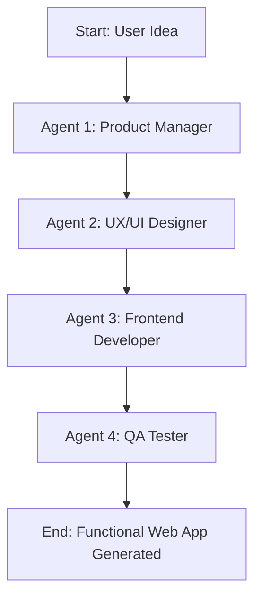

# CTSE Assignment 2: Technical Report

## 1. Problem Domain
The chosen problem domain is **Automated Internal Software Engineering Workflows**, specifically an **"Autonomous Software Factory"**. 

Modern software development involves repetitive boilerplate coding, styling, and basic QA testing. This project automates the front-end web development pipeline using a Multi-Agent System (MAS). The system takes a single 1-sentence prompt describing a desired web application (e.g., "A sleek dark-mode Pomodoro timer") and orchestrates a team of agents to write the Product Requirements Document (PRD), design the CSS stylesheet, develop the HTML/JS logic, and finally run an automated Quality Assurance (QA) audit on the generated code.

The final output is a completely functional, beautifully styled local web application that can be instantly opened in any web browser.

## 2. System Architecture
The MAS is built on **LangGraph**, handling state management and sequential routing between agents. **LangChain** and **Ollama** (running the highly capable `qwen2.5-coder` or `llama3.1` model) execute the reasoning entirely locally, ensuring zero API costs and full data privacy.

### Workflow Diagram

### Roles and Responsibilities
- **Agent 1 (Product Manager):** Translates the raw idea into a strict technical spec, enforcing structure and feature constraints.
- **Agent 2 (UX/UI Designer):** Reads the spec and writes modern, attractive Vanilla CSS (focusing on layout, colors, and animations).
- **Agent 3 (Frontend Developer):** Reads the spec and the existing CSS, and writes the semantic HTML alongside the interactive Javascript logic.
- **Agent 4 (QA Tester):** Reviews the code generated by the Developer and Designer, running an automated script to ensure required tags (DOCTYPE, link tags, syntax closures) are present.

## 3. Agent Design and Reasoning Logic
Each agent in the swarm is designed with specific system prompts and designated constraints to avoid hallucination and ensure functional code output.
- **Interaction Strategy:** A sequential pipeline model was used. Code generation intrinsically follows a chronological flow: Spec -> Design -> Implementation -> Testing.
- **System Prompts:** 
  - The prompts enforce strict personas (e.g., "You are an expert UX/UI Designer").
  - The prompts enforce output constraints (e.g., "Output ONLY valid CSS code. Do NOT write HTML").

## 4. Custom Tools
Each agent uses a distinct custom Python tool written with type-hinting and docstrings.
1. `write_spec_file(idea: str, spec_content: str) -> str`: Writes the generated PRD to `SPEC.md`. Used by the Product Manager.
2. `generate_stylesheet(css_content: str) -> str`: Parses the LLM output, strips Markdown blocks, and writes to `style.css`. Used by the UX Designer.
3. `generate_application(html_content: str) -> str`: Parses the LLM output and writes the HTML/JS to `index.html`. Used by the Frontend Developer.
4. `run_code_audit(html_path: str, css_path: str) -> dict`: Opens the generated files, checks for critical HTML/CSS syntax components, and calculates a health score. Used by the QA Tester.

## 5. State Management and Observability
- **State Management:** A `TypedDict` (`FactoryState`) acts as the global state. This dictionary holds variables like `app_idea`, `technical_spec`, `css_design`, `html_js_code`, and `qa_status`. As LangGraph routes from node to node, it passes this entire dictionary, allowing each agent to "read" the results of the previous agents securely without context loss.
- **Observability:** An `AgentOps` logger (`logger`) is instantiated in `main.py`. A wrapper function (`wrap_node_with_logging`) wraps every agent node, intercepting the input state, executing the node, and logging the output delta. This creates a detailed `factory_execution.log` file tracking every transition without cluttering the main logic.

## 6. Testing and Evaluation Methodology
A deterministic evaluation script was developed using `pytest` (`test_tools.py`). We implemented property-based assertions for each tool to validate the agent's interaction with the file system:
- `test_write_spec_file`: Asserts file creation and success messages.
- `test_generate_stylesheet`: Asserts correct CSS writing and formatting.
- `test_generate_application`: Asserts successful HTML rendering.
- `test_run_code_audit`: Writes dummy "good" and "bad" files to test the QA script's ability to accurately dock points for missing DOCTYPEs or unlinked stylesheets.

## 7. Individual Contributions
*Note to students: replace these placeholders before submitting.*
- **Student 1:** Developed the Product Manager Agent and `write_spec_file` tool. Wrote evaluation tests.
- **Student 2:** Developed the UX/UI Designer Agent and `generate_stylesheet` tool. Wrote evaluation tests.
- **Student 3:** Developed the Frontend Developer Agent and `generate_application` tool. Wrote evaluation tests.
- **Student 4:** Developed the QA Tester Agent and `run_code_audit` tool. Wrote evaluation tests.
